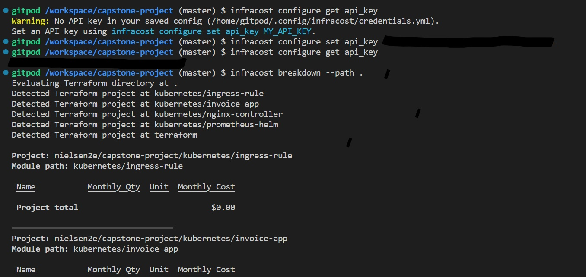
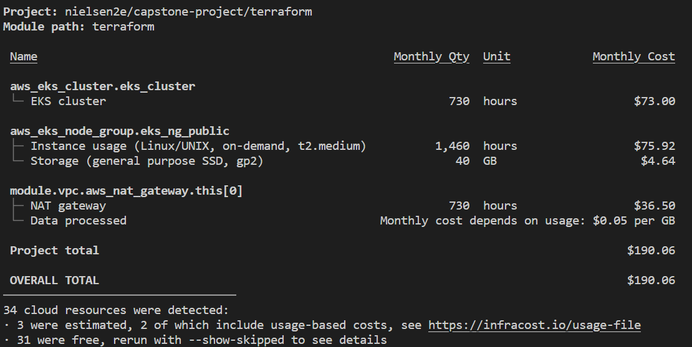
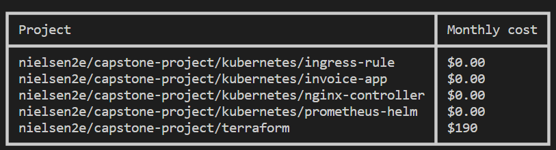

## 1. Install Infracost
```sh
# Downloads the CLI based on your OS/arch and puts it in /usr/local/bin
curl -fsSL https://raw.githubusercontent.com/infracost/infracost/master/scripts/install.sh | sh
```
## 2. Get API key
```sh
infracost auth login
```
The key can be retrieved with `infracost configure get api_key`.

## 3. Show cost estimate breakdown
Infracost parses the project locally to determine resource types and quantities needed to calculate costs. The --path flag should point to your Terraform directory.
```sh
cd my-terraform-project
```
```sh
# Terraform variables can be set using --terraform-var-file or --terraform-var
infracost breakdown --path .
```





